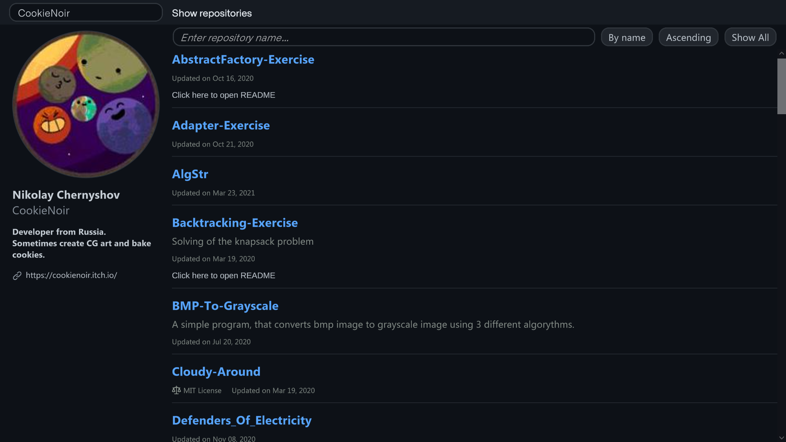

# Github repositories viewer
Web app for fast reading repositories info. Made with [Unity](https://unity.com/ru) & [Octokit](https://github.com/octokit/octokit.net).

You can browse all open repositories of any user and move to their default branches and README files with a single click.
The app supports searching repositories by name, sorting repositories by name and last update date, allows to hide repositories without readme file.

Example:
